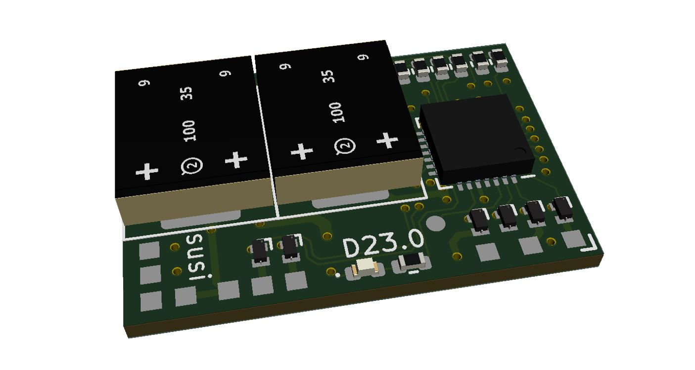
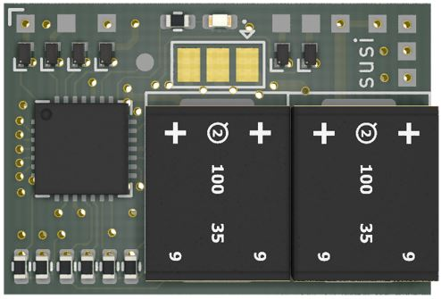
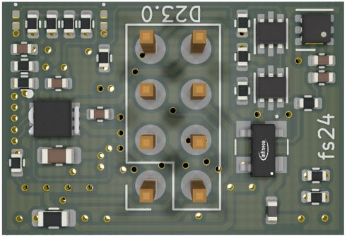
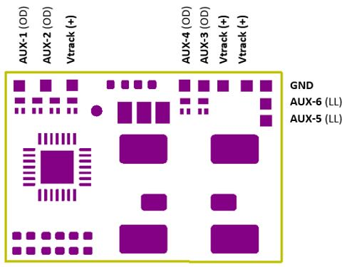
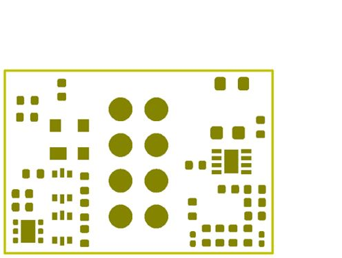

# RTB_D23

The D23 decoder is a double sided mobile decoder with 8-pol NEM 652 connector. The decoder is designed to integrate into the [RTB](https://rtb4dcc.de/concept/) digital control infrastructure.

See also

- [RTB_D12 - custom](https://github.com/git4dcc/RTB_D12) (Fleischmann V100)
- [RTB_D13 - custom](https://github.com/git4dcc/RTB_D13) (Minitrix coach)
- [RTB_D15 - custom](https://github.com/git4dcc/RTB_D15) (Minitrix V160)
- [RTB_D16 - NEM651](https://github.com/git4dcc/RTB_D16)
- [RTB_D20 - NEM651](https://github.com/git4dcc/RTB_D20)
- [RTB_D21 - Next18](https://github.com/git4dcc/RTB_D21)
- [RTB_D22 - Plux16](https://github.com/git4dcc/RTB_D22)

User Guides

- User Guide - DE
- [User Guide - EN](https://rtb4dcc.de/rtb_decoder_reference_en/)

 

## Decoder features,
- **NEM 652** connector
- **DCC**
  - DCC-A automatic logon
  - DCC-R protocol extension
  - Service Mode Programming
- **Railcom**
  - Channel 1/2
  - POM, xPOM
  - DYN: Speed, QoS, Track-voltage, Motor-current, AUX-current, Temp, Distance travelled
- Double sided
- Dimension: 19 x 12 mm
- 7-28V track voltage
- heartbeat LED
- adjustable max motor current (default 500mA)
- adjustable max AUX current (default 500mA)
- over temp protection
- Function output: LF/LR (dimmable, 1.4kHz) open drain
- Function output: AUX1 (dimmable, 1.4kHz) open drain via NEM 652 connector
- Function output: AUX2/AUX3/AUX4 open drain via solder pads
- Function output: AUX5/AUX6 logic level (3.3V) or ZBCLK/ZBDAT (3.3V)
- onboard buffer capacitor (2x 100uF/35V)
- <10mA idle power consumption
- Firmware update over main tracks via DCC-R protocol

# Hardware
The current PCB layout uses SMD footprints with 0.5mm pitch and 0402 parts. Reflow soldering is mandatory whereas handsoldering near to impossible.

   

## PCB
- 6-layer PCB, FR4, 18 x 12 x 0.8mm (double sided)
- CPU: AVR64DD28
- Motor bridge: DRV8231

## Kicad
[Schematic](doc/D23_schematic.pdf) | [Layout](doc/D23_layout.pdf) | [Gerber](gerber)

Dependency

 

:yellow_circle: Requires my Kicad project library [RTB_SamacSys](https://github.com/git4dcc/RTB_SamacSys) in the same directory tree.

## Firmware
Filename structure: { **pcb** }{ **code** }{ **version** }.hex

Example: **D23F0001**.hex

|   | Description |
| --- | --- |
| **pcb** | Name of matching hardware (**D23**) |
| **code** | Type of code contained (**R**=rom, **B**=bootloader, **F**=flash, **U**=bld update, **P**=UPDI factory code) |
| **version** | Release version (**####**) |

[Firmware files](firmware)

## UPDI
The fuse settings as well as the P-code (D23Pxxxx.hex) has to be installed by using UPDI. 
Connecting the decoder via its track pins to a 5V(DC) power supply will boot its CPU. This way, its easy to program the fuses and flash.

Details

| Fuse Setting | P-code Install |
| --- | --- |
|||

# Images
| top | bottom |
| --- | --- |
|  |  |

# YouTube
Some YouTubes to see the D23 decoder in action.  

This project is intended for hobby use only and is distributed in accordance with the Apache License 2.0 agreement.
